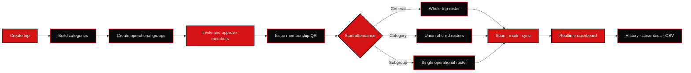

<div align="center">
  

  # HAAJAR

  ### Trips move. People move. Attendance should keep up.

  **A secure, offline-aware coordination and attendance platform for real-world group travel.**

  [](https://github.com/007-Akira/Haajar/releases)
  [](mobile/app.json)
  [](https://expo.dev)
  [](supabase/)
  [](mobile/tests/)

  <sub>Built for organisers, volunteers, and travellers who cannot afford to lose track of the group.</sub>
</div>

---

## The idea

Haajar turns a trip into a living operational map. Organisers create a trip, arrange people into categories and subgroups, invite members, and run attendance from multiple phones. Members carry a privacy-conscious QR membership credential; volunteers scan tickets, mark attendance, and keep working when connectivity becomes unreliable.

The interface pairs a warm-paper editorial canvas with hard black geometry and blood-red accents—a manga-inspired visual language designed to remain fast and legible in crowded, high-pressure situations.

## What the beta includes

| Organise | Join and belong | Run attendance | Stay reliable |
|---|---|---|---|
| Trips and hierarchical groups | Code, link, and invitation QR joining | General, category, and subgroup roll calls | Realtime multi-device updates |
| Category and operational subgroup structure | Dynamic registration forms | Camera QR scanning and manual marking | Offline subgroup roster and sync |
| Role management and sibling transfers | Approval and rejection workflow | Temporary General-attendance volunteers | Idempotent duplicate handling |
| Safe edit, archive, and delete lifecycle | Rotatable membership QR credentials | Remaining and absent views | Attendance history and CSV export |
| Personal **Archive for Me** | Deep-link-aware navigation | Attendance-start push notifications | Notification inbox |

## How Haajar flows



## Security by construction

Haajar treats attendance and QR credentials as security-sensitive data, not ordinary client state.

- Row Level Security protects user and trip boundaries.
- Privileged mutations go through narrow, authenticated PostgreSQL RPCs.
- Membership and push tokens are stored encrypted or hashed server-side.
- Mobile clients never receive the Supabase service-role key or worker secret.
- Attendance writes are atomic and idempotent, including offline reconciliation.
- Push jobs are deduplicated and routes are restricted to validated internal paths.
- Revoked or rotated QR credentials stop resolving.
- Screenshot and app-switcher privacy protections cover sensitive QR surfaces.
- Android backup is disabled and overlay permission is explicitly blocked.

Read the deeper contracts in [QR resolution](docs/qr-resolution-contract.md), [offline attendance security](docs/offline-attendance-security.md), [push notifications](docs/push-notifications.md), and [attendance RPCs](docs/attendance-rpc-contracts.md).

## Architecture

```text
mobile/                         Expo + React Native application
├── src/app/                    Expo Router routes
├── src/features/               Domain-focused UI, services, and state
├── src/components/             Shared editorial design system
├── src/types/database.types.ts Generated Supabase contract
└── tests/                      Mobile unit and contract tests

supabase/
├── migrations/                 Ordered schema, RLS, RPC, and lifecycle history
├── functions/                  Secret-authenticated push delivery worker
└── tests/database/             pgTAP integration and concurrency suites
```

| Layer | Technology |
|---|---|
| Mobile | Expo 57, React Native 0.86, React 19, Expo Router |
| UI | Uniwind, Reanimated, shared editorial components |
| Data | Supabase JS, TanStack Query, Realtime |
| Device | Camera, Notifications, Secure Store, SQLite, Media Library |
| Backend | PostgreSQL, RLS, security-definer RPCs, Edge Functions |
| Delivery | EAS Build, release-signed internal Android APKs |

## Run locally

### Requirements

- Node.js and npm
- Android Studio/SDK or a physical Android device
- Docker for the local Supabase stack and pgTAP suite

### Mobile

```bash
cd mobile
npm install
cp .env.example .env
# Add only the public Supabase URL and anon key to .env.
npm start
```

Never place service-role credentials, signing passwords, or `PUSH_WORKER_SECRET` in the mobile environment.

### Quality gates

```bash
cd mobile
npm run check
npx expo install --check
```

`npm run check` runs TypeScript, ESLint, Prettier verification, and the complete mobile test suite.

### Database integration tests

```bash
npx supabase start
npx supabase db reset --local --no-seed
npx supabase test db
npx supabase stop --no-backup
```

The [database CI workflow](.github/workflows/database-tests.yml) performs the same certification against a disposable local stack. It never connects to or mutates the hosted production database.

## Beta release

The current candidate is **Haajar v0.9.0-beta.2** (`app.haajar.mobile`, Android versionCode `5`). It is intended for a small closed group of Android testers and will be distributed as a standalone, release-signed APK through [GitHub Releases](https://github.com/007-Akira/Haajar/releases).

Release builds use EAS-managed Android credentials. Keystores and signing passwords are never committed. Every future beta must use the same release key so Android can install it as an update.

```bash
cd mobile
npx eas-cli build --platform android --profile preview
```

## Beta testing priorities

- Google OAuth and persistent sessions from an installed APK
- Invitation links and QR scanning from cold start
- Membership QR scanning, rotation, and revoked-token rejection
- General attendance with multiple volunteers
- Category and subgroup access boundaries
- Realtime updates across multiple phones
- Airplane-mode scanning, restart, and reconnect synchronization
- Push delivery and safe notification deep links
- CSV export, QR sharing, lifecycle permissions, and Android back gestures

## Documentation

- [Development testing](docs/development-testing.md)
- [Database testing](docs/database-testing.md)
- [QR privacy device checklist](docs/qr-privacy-device-checklist.md)
- [QR resolution contract](docs/qr-resolution-contract.md)
- [Offline attendance security](docs/offline-attendance-security.md)
- [Push notification architecture](docs/push-notifications.md)
- [Attendance RPC contracts](docs/attendance-rpc-contracts.md)

---

<div align="center">
  <strong>HAAJAR</strong><br />
  <sub>Keep the group together.</sub>
</div>
